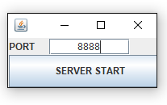
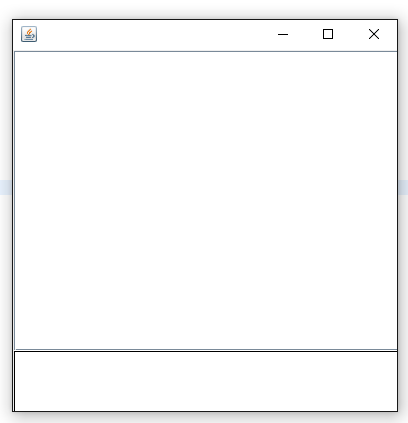
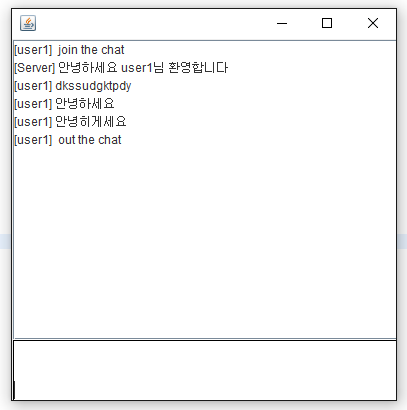
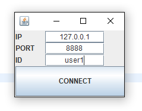
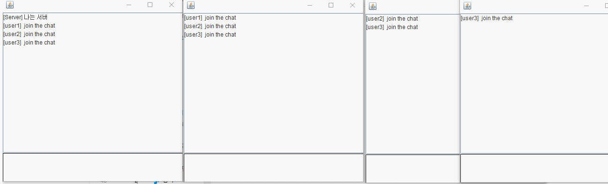

# Java Multichatting

---------------------------------------

##### 사용 기술 : JavaSocket + JavaSwing
##### 제작 목적 : 자바 소켓과 스윙을 공부한겸 만들어봤습니다.
---------------------------------------
#### Server

##### 서버프로그램 실행시 초기화면입니다.
##### 사용하실 포트를 입력후 버튼을 누르면됩니다.

##### 성공적으로 열릴시 창이열립니다.
##### 이창으로 접속중인 모든 유저들에게 메세지를보낼수있고
##### 유저들이 접속했을때나 퇴장시 알림이뜹니다.

# 
# 

#### Client

##### 클라리언트 프로그램 실행시 초기화면입니다.
##### 서버 아이피주소 , 포트, 사용할  ID 입력후 버튼을 누르면됩니다.
##### 성공적으로 접속시 유저들과 대화를 나눌수있습니다.
##### 창을 닫거나 exit 입력시 소켓 연결이 끊깁니다.
# 
# 
# 

#### 시연 영상
